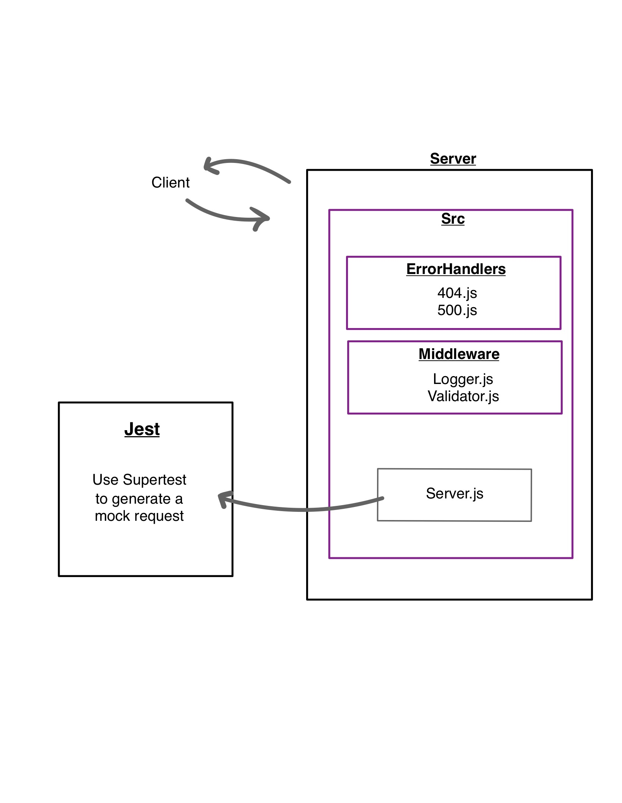

# LAB - Class 02

## Project: basic express server

### Author: Brenda Jow

### Problem Domain  

build a stander compliant express server

### Links and Resources

- [GitHub Actions ci/cd](https://github.com/brenda70904/-basic-express-server/actions)
- [back-end server url](https://basic-express-server-dev-ivoq.onrender.com)
<!-- - [front-end application](http://xyz.com) (when applicable) -->

### Setup

#### `.env` requirements 

not require for this lab.

#### How to initialize/run your application

- e.g. `npm start`

#### How to use your library

#### Features / Routes

- Feature One: basic express with jest to test all routes.
- GET : `/person` routes, provide name = _______ in quary, return an obj with query sting.

#### Tests

- How do you run tests?

`npm start` to run the test.

library : Jest, Supertest.

- Any tests of note?

N/A

- Describe any tests that you did not complete, skipped, etc
    try to test the quary with as long as the quary is string, return pass. Did not work.

#### UML

